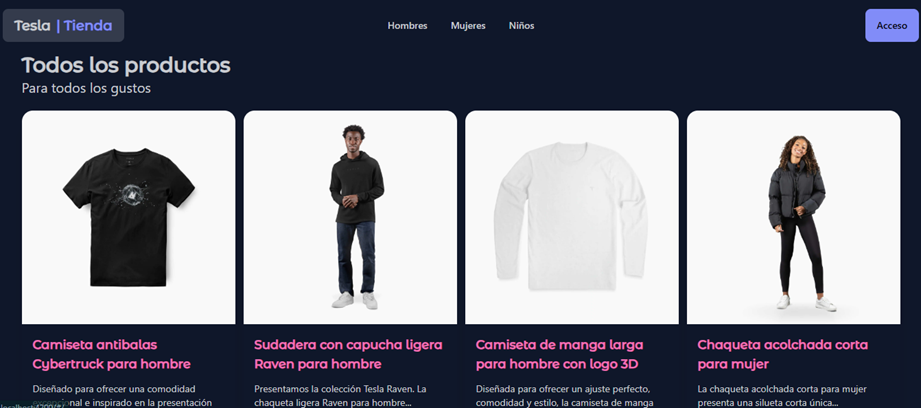
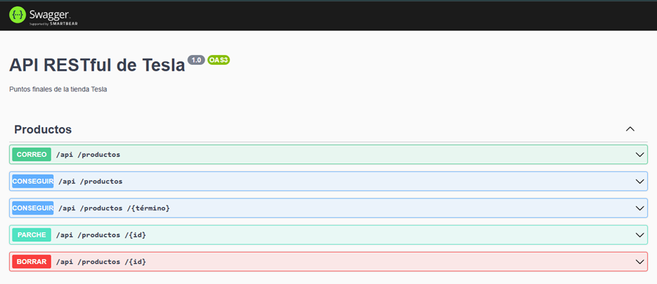
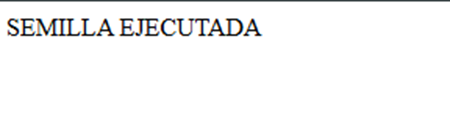

# 🐳 TesloShop - Proyecto Final Docker

##  Descripción

Este proyecto consiste en la contenerización de una aplicación full stack utilizando Docker y Docker Compose. La aplicación está compuesta por:

* Frontend desarrollado en Angular
* Backend desarrollado en NestJS
* Base de datos PostgreSQL

El objetivo es implementar una arquitectura multicontenedor completamente funcional.

---

## 🏗️ Arquitectura

La aplicación está compuesta por tres servicios principales:

* **Frontend (Angular + Nginx)** → Interfaz de usuario
* **Backend (NestJS)** → API REST
* **Base de datos (PostgreSQL)** → Persistencia de datos

Flujo de comunicación:

Usuario → Frontend → Backend → Base de datos

---

## 🐳 Dockerfile

### Backend

Se implementa un Dockerfile con **multi-stage build**:

* `dev`: entorno de desarrollo
* `builder`: compilación
* `prod`: imagen final optimizada

Esto permite reducir el tamaño de la imagen y mejorar la seguridad.

---

### Frontend

Se utiliza multi-stage:

* Build con Node
* Deploy con Nginx

La imagen final es ligera porque no incluye Node.

---

## ⚙️ Docker Compose

Se definen 3 servicios:

* `db`: PostgreSQL
* `backend`: API NestJS
* `frontend`: Angular + Nginx

### Características:

* Uso de variables de entorno
* Red personalizada (`teslo-network`)
* Volúmenes para persistencia de datos
* `depends_on` para control de arranque

---

## 🚀 Ejecución del proyecto

### 1. Clonar repositorio

```bash
git clone https://github.com/DEV-SENA-TRAINING/tesloshop-app.git
cd tesloshop-app
```

### 2. Crear archivo de entorno

```bash
cp .env.example .env
```

Editar variables sensibles:

```env
POSTGRES_PASSWORD=tu_password
DB_PASSWORD=tu_password
JWT_SECRET=tu_secreto
```

---

### 3. Ejecutar contenedores

```bash
docker compose up --build -d
```

---

### 4. Verificar estado

```bash
docker compose ps
```

---

## 🌐 Acceso a la aplicación

* Frontend: http://localhost
* Backend API: http://localhost:3000/api
* Swagger: http://localhost:3000/api/docs

---

## 🌱 Seed de datos

Ejecutar:

```bash
http://localhost:3000/api/seed
```

Esto cargará datos de prueba en la base de datos.

---

## 🛑 Detener aplicación

```bash
docker compose down
```

Eliminar todo:

```bash
docker compose down -v
```

---

## ⚠️ Problemas comunes

* Error de conexión a DB → revisar `.env`
* Puerto ocupado → cambiar puertos
* Frontend no carga → revisar build Angular

---

## 🎥 Video de sustentación

(Agregar aquí el link de YouTube)

---

## 📷 Evidencias






---

## 👨‍💻 Autor

* Nombre: Kelin Marcela Montoya Ruiz
* Programa: ADSO / SENA
* Actividad: Proyecto Final Docker
